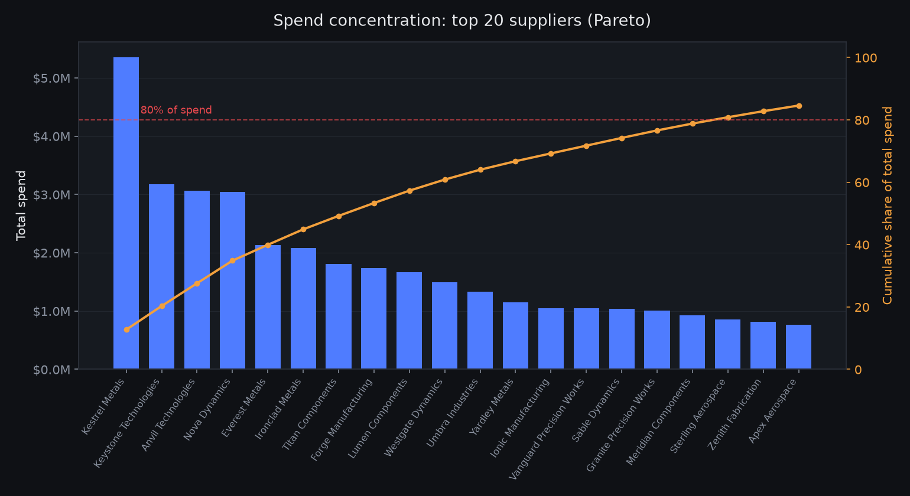
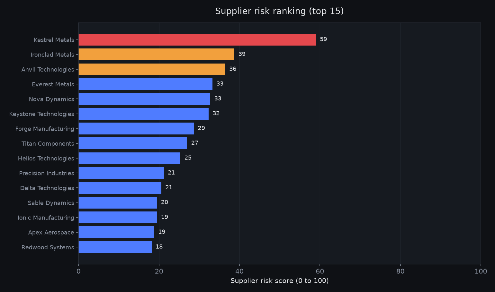
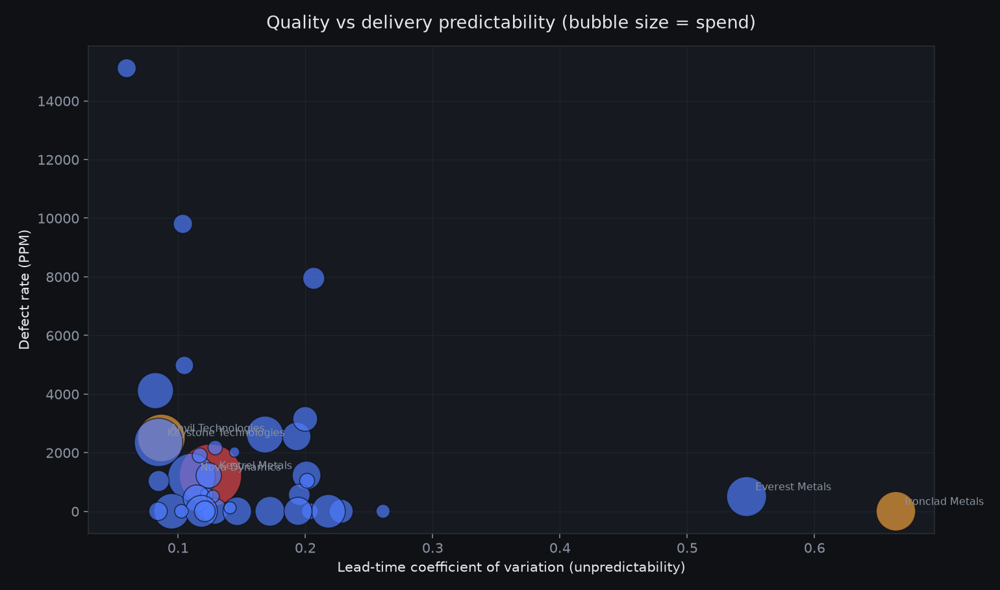
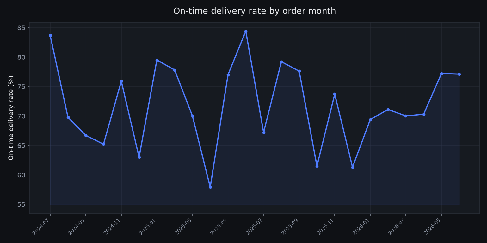

# Supply Chain Spend and Supplier Risk Optimizer

A procurement analytics tool that ranks a hardware supply base on six dimensions (spend concentration, sole-source exposure, defect rate, lead-time variance, on-time delivery, and late-order risk), segments risk by part family, and models a concrete annual savings opportunity. It surfaces where to negotiate, where to dual-source, and which suppliers to put on a corrective action plan.

## Why this matters

An organization that builds complex hardware runs on hundreds of suppliers, and the risk is never spread evenly. A small number of them quietly control most of the spend, gate the build schedule, or drift on quality until a line goes down. The job of business operations is to find those suppliers before they cost you a launch date, and to redirect spend and attention where the return is highest. This tool does that mechanically: it turns 1,200 purchase orders into a ranked, defensible action list and a purchasing dashboard a buyer or an ops lead can work down on a Monday morning.

## What the analysis found

Numbers below are the actual output of the pipeline in this repository, computed from the committed dataset (`data/`), the scorecard (`output/supplier_scorecard.csv`), the savings breakdown (`output/savings_breakdown.csv`), and the part-family segmentation (`output/part_family_segmentation.csv`).

- **Total spend analyzed:** $41,988,784 across exactly 1,200 purchase orders and 40 suppliers over a 24 month window.
- **Modeled annual savings opportunity:** $410,931, which is 0.98% of total spend, built from five documented buckets (see the table below).
- **Concentration:** the top 10 suppliers control 60.9% of total spend. Composites is the most concentrated part family (Herfindahl index 5,309, one supplier owns 71% of it across only 4 qualified suppliers).
- **Sole-source exposure:** 8 material single-source suppliers carry no qualified alternate. The largest is Kestrel Metals, single-source at 12.7% of all spend ($5.35M) and the highest risk score in the base (59.0, the only supplier in the High band).
- **Delivery:** the supply-base average on-time rate is 71.9%. The worst performer, Precision Industries, delivers on time only 23.1% of the time across 13 POs.
- **Quality:** Helios Technologies runs 15,114 defective parts per million and Delta Technologies runs 9,804 PPM, both an order of magnitude above the base.
- **Schedule risk in dollars:** $11,826,856 of PO value arrived after the promised date. The single largest concentration of that exposure sits with Kestrel Metals ($1.82M).

### Modeled annual savings by bucket

| Opportunity bucket                  |  Base spend | Rate | Modeled savings | Basis                                                       |
| ----------------------------------- | ----------: | ---: | --------------: | ----------------------------------------------------------- |
| Tail-spend consolidation            |  $4,094,756 | 4.0% |        $163,790 | 16 tail suppliers, consolidation and pricing tiers          |
| Concentrated-category renegotiation | $20,258,563 | 0.6% |        $121,551 | 7 concentrated single-source suppliers, price renegotiation |
| Sole-source risk reduction          | $21,308,289 | 0.3% |         $63,925 | cost avoidance from qualifying a second source              |
| Late-order / expedite avoidance     | $11,826,856 | 0.4% |         $47,307 | expedite premium avoided on late PO value                   |
| Defect / quality cost reduction     |     $57,430 |  25% |         $14,358 | recovery of rework and scrap on 748 defect units            |
| **Total**                           |             |      |    **$410,931** | **0.98% of total spend**                                    |

Every rate is a conservative, bottom-of-range procurement assumption applied to a real dollar base pulled straight from the data, not an aspirational figure.

### Recommended actions, in priority order

1. **Qualify a second source for Kestrel Metals (Composites) and Keystone Technologies (Propulsion).** They are single-source and together carry roughly a fifth of total spend with no backup, which is both a continuity risk and a negotiating disadvantage.
2. **Open corrective action on Helios Technologies and Delta Technologies.** Both run defect rates that generate rework and scrap cost regardless of price.
3. **Put Precision Industries and Everest Metals on a delivery improvement plan.** Everest also carries the highest lead-time variance in the base, which makes its delivery timing impossible to plan around.
4. **Consolidate the 16-supplier tail.** Fragmented low-volume spend is where the easiest pricing and overhead savings live.

## How it works

```
data/generate_data.py   ->  suppliers.csv, purchase_orders.csv     (synthetic, seeded, exactly 1,200 POs)
sql/schema.sql          ->  procurement.db tables + indexes
src/load_db.py          ->  loads CSVs into SQLite
sql/analytics.sql       ->  the analytical query library
src/analyze.py          ->  executive summary + four charts
src/supplier_scorecard  ->  six-dimension risk score, ranking, savings model, CSVs
src/part_family.py      ->  part-family risk segmentation
src/build_dashboard.py  ->  self-contained executive dashboard (output/dashboard.html)
```

Everything runs on SQLite through Python's built-in `sqlite3`, so there is no database to stand up. The synthetic data is deterministic (the RNG is seeded), so the numbers above reproduce on every run.

## Supplier Risk Score methodology

Each supplier gets a single score from 0 to 100, where higher means riskier. Six dimensions feed the score. Each is normalized to a 0 to 1 scale across the supply base using min-max scaling, oriented so that 1 is always the riskier end, then combined with the weights below.

| Dimension            | What it measures                                        | Direction         | Weight |
| -------------------- | ------------------------------------------------------- | ----------------- | -----: |
| Spend concentration  | Share of total spend on this supplier                   | Higher is riskier |   0.20 |
| Sole-source exposure | Spend carried by a supplier with no qualified alternate | Higher is riskier |   0.20 |
| Defect rate (PPM)    | Defective parts per million received                    | Higher is riskier |   0.20 |
| Lead-time variance   | Coefficient of variation of lead time (stddev / mean)   | Higher is riskier |   0.15 |
| On-time delivery     | Percent of POs received on or before the promised date  | Lower is riskier  |   0.15 |
| Late-order risk      | Dollar value of POs that arrived late                   | Higher is riskier |   0.10 |

Spend concentration and sole-source exposure are scored as separate dimensions on purpose. A supplier can be large but dual-sourced (concentration risk with a fallback), or mid-sized but the only qualified source for a critical part (continuity risk with no fallback). The two failure modes call for different actions, so they are measured independently. Sole-source exposure is only counted for single-source suppliers at or above 2% of total spend, so small sole sources do not inflate the score.

Weights sum to 1.0 and live in one dictionary at the top of `src/supplier_scorecard.py`, so the model is easy to re-weight and defend.

The scorecard then applies two rules on top of the score:

- **Dual-source flag:** any single-source supplier at or above 3% of total spend is flagged as a dual-sourcing candidate.
- **Process-improvement targets:** suppliers are re-ranked by combined quality and delivery risk to produce the corrective-action shortlist.

## Part-family risk segmentation

Category is treated as part family. `src/part_family.py` rolls the supplier-level scorecard up to the family level so an ops lead can see which commodity areas carry the most risk and what to do about each one. For each family it reports family spend, sole-source share, spend-weighted on-time rate and defect PPM, a risk tier, the dominant risk driver, and the recommended action tied to that driver.

| Part family           | Tier   |       Spend | Sole-source share | On-time | Top risk driver     |
| --------------------- | ------ | ----------: | ----------------: | ------: | ------------------- |
| Composites            | High   |  $7,579,274 |             70.6% |   67.2% | Late-order risk     |
| Propulsion Components | Medium | $14,178,334 |             70.9% |   71.7% | Spend concentration |
| Electronics           | Medium |  $7,823,530 |             52.3% |   66.2% | On-time delivery    |
| Machined Parts        | Low    |  $3,242,983 |             55.8% |   74.3% | On-time delivery    |
| Avionics              | Low    |  $6,069,163 |              0.0% |   81.0% | Spend concentration |
| Fasteners             | Low    |    $769,495 |              0.0% |   67.8% | On-time delivery    |
| Raw Metals            | Low    |  $2,326,004 |              0.0% |   75.2% | On-time delivery    |

Composites is the one High-tier family: it is small in supplier count but heavily sole-sourced and carries the largest single late-delivery exposure in the base. Propulsion Components is the largest spend pool and the clearest renegotiation target.

## Executive dashboard

The pipeline renders a single self-contained purchasing dashboard at `output/dashboard.html`: a dark, Inter-typeset ops view with a KPI row (total spend, 1,200 POs, savings identified, sole-source risk count, average on-time), the full ranked scorecard, the savings breakdown, and the part-family segmentation as clean tables, plus the four charts embedded inline. It has no external network dependency beyond the Tailwind CDN and the Inter web font, so it opens straight from disk.

Executive purchasing dashboard: open `output/dashboard.html`.

## Charts

**Spend concentration (Pareto).** How few suppliers make up most of the spend.



**Supplier risk ranking.** The full score, top 15, colored by risk band.



**Quality vs delivery predictability.** Defect PPM against lead-time variance, bubble sized by spend. The suppliers in the upper right that are also large bubbles are the ones that matter most.



**On-time delivery trend.** Fleet on-time rate by order month.



## How to run

```bash
# from the repo root
python3 -m venv .venv
.venv/bin/pip install -r requirements.txt

# run the full pipeline end to end
./run.sh
# or, equivalently
.venv/bin/python run_all.py
```

The pipeline regenerates the data, rebuilds `procurement.db`, prints the executive summary and the ranked scorecard to the terminal, and writes the charts, the scorecard CSV, the savings breakdown, the part-family segmentation, and `dashboard.html` into `output/`. The generated CSVs, charts, and dashboard are committed, so the analysis is fully viewable without running anything.

## Repository layout

```
data/generate_data.py       synthetic procurement data generator (seeded, 1,200 POs)
data/suppliers.csv          40 suppliers (committed)
data/purchase_orders.csv    1,200 purchase orders (committed)
sql/schema.sql              table definitions, keys, indexes
sql/analytics.sql           commented analytical query library
src/load_db.py              CSV to SQLite loader
src/supplier_scorecard.py   six-dimension risk score and savings model (core deliverable)
src/part_family.py          part-family risk segmentation
src/analyze.py              executive summary and chart generation
src/build_dashboard.py      self-contained executive dashboard builder
output/                     scorecard, savings breakdown, segmentation, charts, dashboard (committed)
run.sh / run_all.py         full pipeline runners
```

## What I would do next

- **Bring in real data.** Swap the synthetic generator for an ERP extract (SAP, Oracle, or NetSuite) and keep the schema and scoring untouched. The pipeline is built so only the loader changes.
- **Add supplier financial health.** A sole-source risk is far worse when the only source is also financially fragile. Layering a credit or D&B signal into the score would catch the suppliers most likely to fail without warning.
- **Model the true cost of a late part.** Right now late-order risk is measured as PO dollar value. The sharper metric is schedule impact: which late parts actually sat on the critical path, and what did the slip cost downstream.
- **Ship a weekly digest.** The scorecard is a batch job today. The natural next step is a scheduled run that flags any supplier whose score moves more than a threshold week over week, so the ops team watches deltas instead of re-reading the whole list.

All glory to God! ✝️❤️
